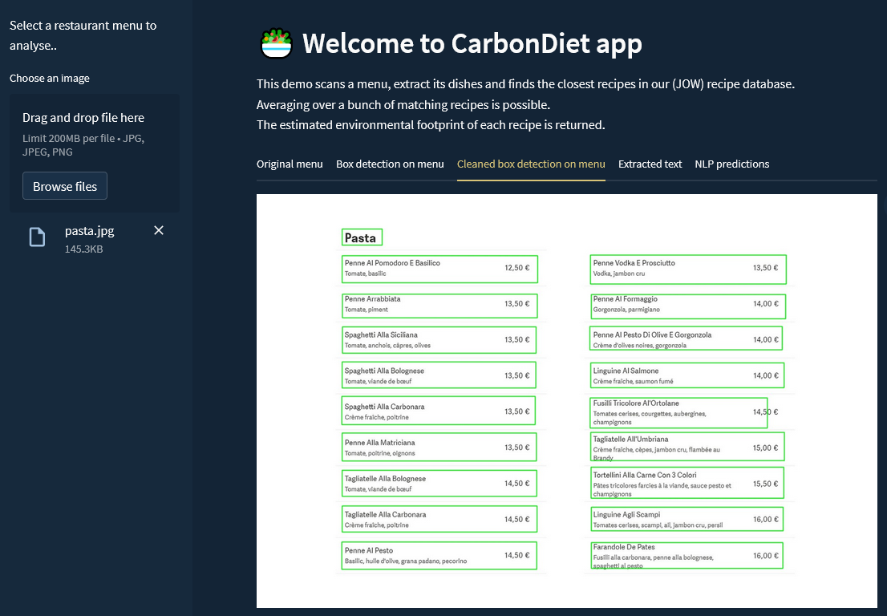
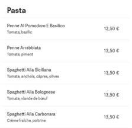
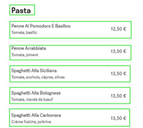
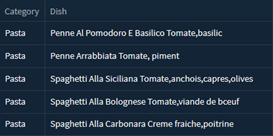
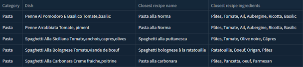
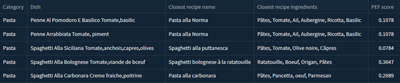

# Carbondiet
Carbondiet is a tool that scans restaurant menus and computes for each identified dish an environmental score.

**The library is currently under development.**

## Streamlit demo

To test the streamlit demo, go to the `streamlit` folder and run   
```
streamlit run index.py
```



## Main steps of the Carbondiet pipeline
1. Carbondiet takes as input a picture of a restaurant menu.    
We illustrate hereafter the Carbondiet pipeline with an example of a menu picture. For better visibility, only a part of the menu is shown but the full menu picture (see above) was actually fed to the algorithm.   
   

2. A box detection algorithm is used to identify each dish on the menu as well as its category (here only "Pasta"). In practice, we trained a YOLO model on [Roboflow](https://roboflow.com/) after having labeled a few dozens of menus.      
 

3. Then text inside each box is extracted with ocerization. For that purpose, we use the [paddleocr](https://pypi.org/project/paddleocr/) package based on the ultra-lightweight pre-trained PaddlePaddle model. <br />   
 

4. Each dish is then matched with the closest recipe in our recipe database. We use the [SentenceTransformers](https://sbert.net/) package (a.k.a. SBERT) from HuggingFace to compute embeddings of the menu dishes and of our recipes, and to calculate similarity scores between a dish and the various recipes so as to identify the closest one. In the streamlit demo, we use a recipe database made of roughly 1400 entries scrapped from [JOW](https://jow.fr/). Preliminary tests have also been made with [Marmiton](https://www.marmiton.org/) recipes and with the [Recipe1M+](http://pic2recipe.csail.mit.edu/) dataset preprocessed and shared by the team of this [repo](https://github.com/jsakv/batch7_tomorrow_datascience). <br />   
 

5. Finally, the Product Environmental Footprint (PEF) of each identified recipe is calculated as follows: $\mathrm{PEF}_{recipe}=\sum_{i}w_i[\mathrm{kg}]\times (\mathrm{PEF}/\mathrm{kg})_i$ where $w_i$ if the quantity (in kg) of the ingredient $i$ in the recipe and $(\mathrm{PEF}/\mathrm{kg})_i$ its PEF score per kg. We use the [Agribalyse](https://agribalyse.ademe.fr/) database to estimate the PEF score of each ingredient and hence deduce the PEF score of the various dishes in the menu. <br />    
      
Note that the PEF score is based on 16 environmental criteria (including e.g. the carbon footprint). The higher this score, the greater the impact on the environment. *Roughly speaking*, dishes with $\mathrm{PEF}\lesssim 0.1$ are excellent from an environmental point of view while dishes with $\mathrm{PEF}\gtrsim 0.5$ should be avoided.    

## References/Acknowledgements
We are particularly grateful to the developers and/or contributors of:
- [Agribalyse](https://agribalyse.ademe.fr/) database, giving the Product Environmental Footprint (PEF score) of thousands  of ingredients.  
- [JOW](https://jow.fr/) website from which most of our recipes are scrapped.    
- [Marmiton](https://www.marmiton.org/) website also used for scrapping recipes (not yet used in the carbondiet pipeline).
- The team of the [batch7_tomorrow_datascience](https://github.com/jsakv/batch7_tomorrow_datascience) project for preprocessing and sharing their recipe dataset based on [Recipe1M+](http://pic2recipe.csail.mit.edu/) (not yet used in the carbondiet pipeline). 
- The [Roboflow](https://roboflow.com/) platform leveraged for the box detection task.
- The [paddleocr](https://pypi.org/project/paddleocr/) package used for extracting text from menus.
- The [HuggingFace](https://huggingface.co/) platform for sharing and maintaining the [SentenceTransformers](https://sbert.net/) package used for the NLP task.